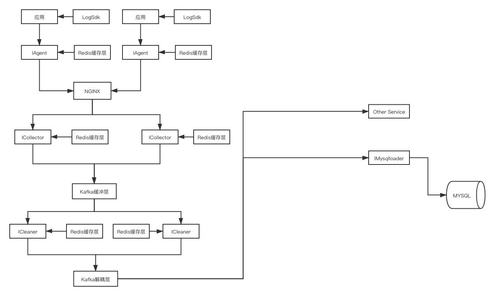

#### 日志服务架构图
- 基础架构
  - 
- 可拓展架构
  - 

#### 数据清洗(ICleaner)


#### 依赖环境
- PHP 7.x
- Swoole 4.x
- Swoft 2.x

#### 启动方式
- 进程池 Server
  - php bin/swoft process:start

#### 清洗文件配置方式
```
[
    19 => [ // 19 为项目名
        't_log_god_body_op' => [ // t_log_god_body_op 为对应的表或队列名称
            'comment' => 'god_body_op',
            'fields' => [
                'pid' => [  //  pid 为数据字段
                    'type' => 'BIGINT', // 要清洗后的类型
                    'notes' => 'pid'
                ],
                'agent_id' => [
                    'type' => 'INT',
                    'notes' => '代理ID'
                ],
                'server_id' => [
                    'type' => 'INT',
                    'notes' => '区服ID'
                ],
                'account_name' => [
                    'type' => 'STRING',
                    'notes' => '账号名'
                ]
            ]
        ]
    ]
]
```
  
#### 不足之处
- 错误机制未完善
- 后续需要通过 Supervisord 对服务进行统一管理
- 系统监控还没有
- 清洗配置应该抽象到独立的配置中心